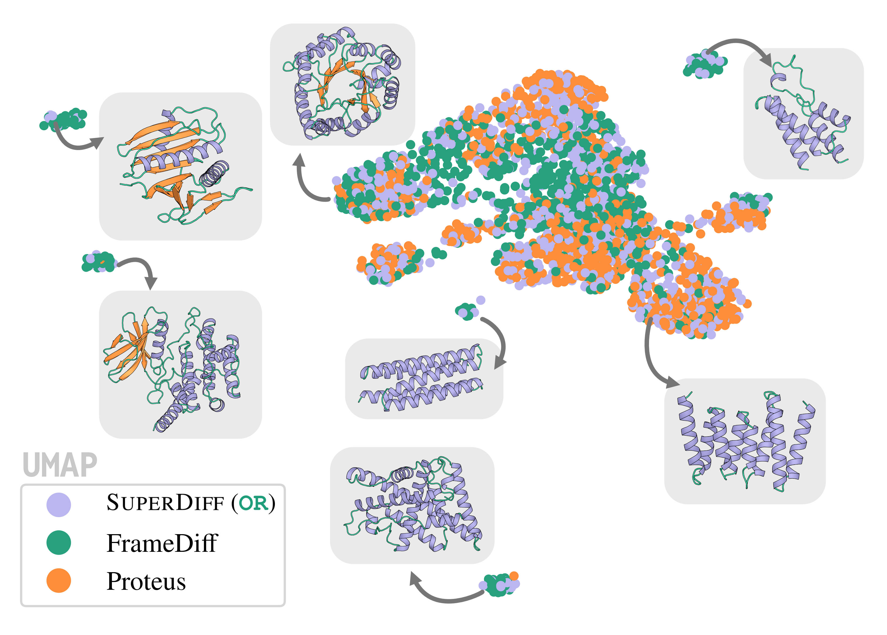

<div align="center">

# SuperDiff Experiment: Unconditional Protein Generation

</div>

<p align="center">
  
</p>


This repo is based off of two existing protein generation models: [Proteus](https://github.com/Wangchentong/Proteus) and [FrameDiff](https://github.com/jasonkyuyim/se3_diffusion).


## Installation

To install required dependencies, you may create a `conda` environment from the provided `environment.yml` file using:

```
conda env create -f environment.yml

```

If you run into issues, you can create the environment on your own using the following:
<details>
<summary>
Step-by-step installation instructions
</summary>

```
conda create -n superdiff_proteins python=3.9
conda activate superdiff_proteins

conda install pytorch==1.11.0 torchvision torchaudio cudatoolkit=10.2 -c pytorch # CUDA 10.2 needed for pdbfixer, PyTorch > 1.9 needed for ESMFold
conda install dgl-cuda11.1 -c dglteam
conda install -c conda-forge pdbfixer gcc boost-cpp
conda install pyg -c pyg ## for proteus
conda install -c salilab dssp

pip install pyrsistent hydra-core biopython hydra-joblib-launcher
pip install transformers accelerate==0.5.0
pip install fair-esm generate-chroma==1.0.0
pip install dm-tree GPUtil ml_collections tmtools mdtraj biotite
pip install wandb==0.12.0
pip install deepspeed ## ensure CUDA_HOME is set
pip install numpy==1.26.4
pip install iopath
pip install "git+https://github.com/facebookresearch/pytorch3d.git" ## if having trouble installing pytorch3d, may need to install CUB with `conda install -c bottler nvidiacub` or install without the CUDA module loaded if applicable
pip install functorch==0.1.1
pip install protobuf==3.20.*
pip install dataframe-image==0.2.4

cd ./se3_diffusion
pip install -e .

cd ../Proteus
pip install -e .

cd ../

```
</details>
Please open an issue if you have any difficulties setting up the environment or email the authors.

## Example usage

```
cd superdiff
conda activate superdiff_proteins

SEED=0
LENGTH=100

# SuperDiff(OR), l=0
logp=0
temp=1
python3 inference.py inference.save_path="./generated_proteins/superdiff_sde_500t_OR_temp${temp}_logp${logp}/length_${LENGTH}/model_outputs/" inference.seed=$SEED inference.stochastic=True inference.sample_length=$LENGTH inference.temp_trans=$temp inference.logp_trans=$logp inference.temp_rots=$temp inference.logp_rots=$logp

# SuperDiff(OR), l=1
logp=1
temp=1
python3 inference.py inference.save_path="./generated_proteins/superdiff_sde_500t_OR_temp${temp}_logp${logp}/length_${LENGTH}/model_outputs/" inference.seed=$SEED inference.stochastic=True inference.sample_length=$LENGTH inference.temp_trans=$temp inference.logp_trans=$logp inference.temp_rots=$temp inference.logp_rots=$logp

# SuperDiff(AND)
logp=0
python3 inference.py inference.save_path="./generated_proteins/superdiff_sde_500t_AND_logp${logp}/length_${LENGTH}/model_outputs/" inference.seed=$SEED inference.stochastic=True inference.sample_length=$LENGTH inference.kappa_operator="AND" inference.logp_trans=$logp inference.logp_rots=$logp

# Avg. of outputs
KAPPA=0.5
python3 inference.py inference.save_path="./generated_proteins/mixing_${KAPPA}/length_${LENGTH}/model_outputs/" inference.seed=$SEED inference.mixing_method="mixture" inference.sample_length=$LENGTH inference.kappa=${KAPPA}

# Proteus baseline
python3 inference.py inference.save_path="./generated_proteins/proteus_sde_500t/length_${LENGTH}/model_outputs/" inference.seed=$SEED inference.stochastic=True inference.mixing_method="baseline_proteus" inference.sample_length=$LENGTH

# FrameDiff baseline
python3 inference.py inference.save_path="./generated_proteins/framediff_sde_500t/length_${LENGTH}/model_outputs/" inference.seed=$SLURM_ARRAY_TASK_ID inference.stochastic=True inference.mixing_method="baseline_framediff" inference.sample_length=$LENGTH
```

This will automatically compute self-consistency results and save them in a directory `/path/to/length_${LENGTH}/self_consistency`. To replicate the results in the paper, run each setting for seeds 0-49 for lengths 100, 150, 200, 250, 300.

## Evaluation

To evaluate the generated proteins, you will need to download binaries for [MaxCluster](https://www.sbg.bio.ic.ac.uk/maxcluster/download.html), [Foldseek](https://github.com/steineggerlab/foldseek), and [dssp](https://github.com/cmbi/dssp).
Foldseek requires a PDB database. We recommend [this one](https://github.com/steineggerlab/foldseek?tab=readme-ov-file#databases).

Make sure that Foldseek is contained in your `PATH` variable: `export PATH=/path/to/foldseek/bin/:$PATH` and update the path to each binary in `superdiff/run_metrics.py`.

Then, run the following:

```
cd superdiff
python3 run_metrics.py --results_dir="./generated_proteins/superdiff_sde_500t_OR_temp1_logp0"
```

**Note:** The  structure of the results directory should be `/path/to/results_dir/length_${LENGTH}/self_consistency` where `${LENGTH}` is the length of the backbone. 
